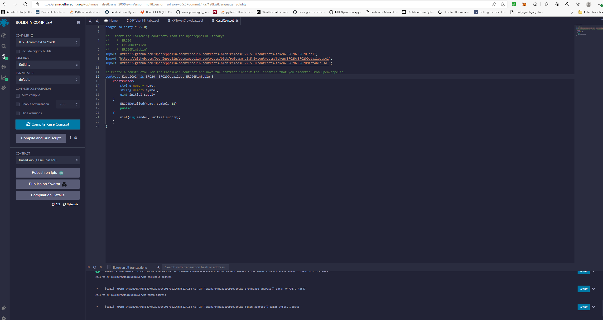
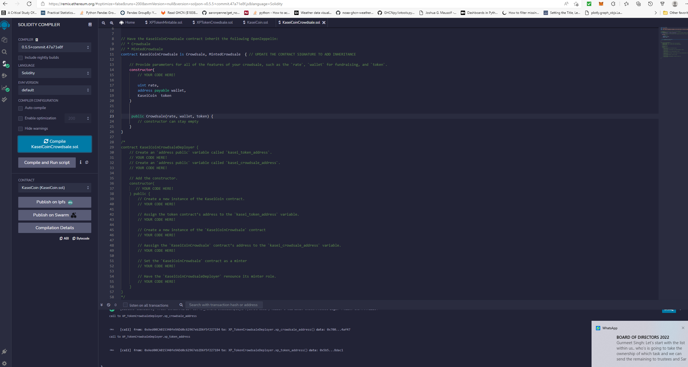
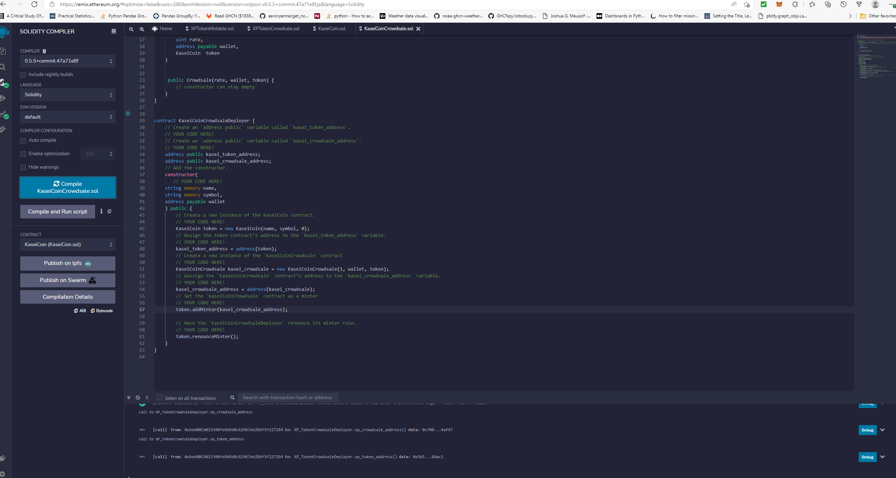
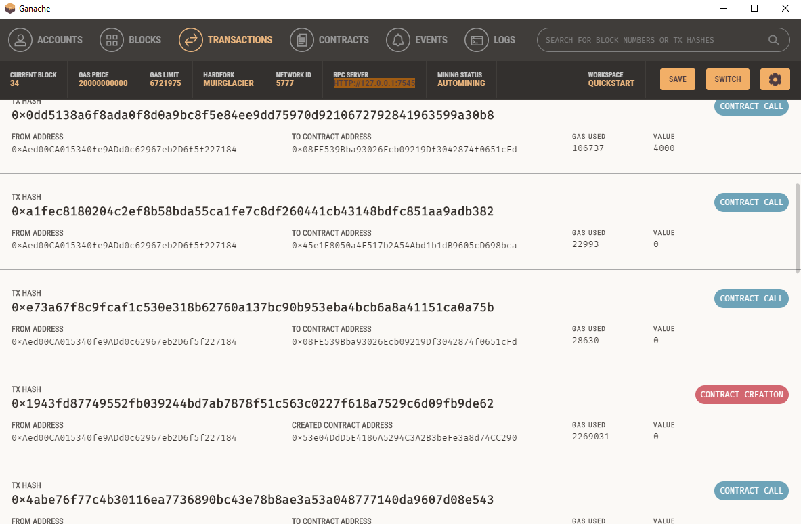
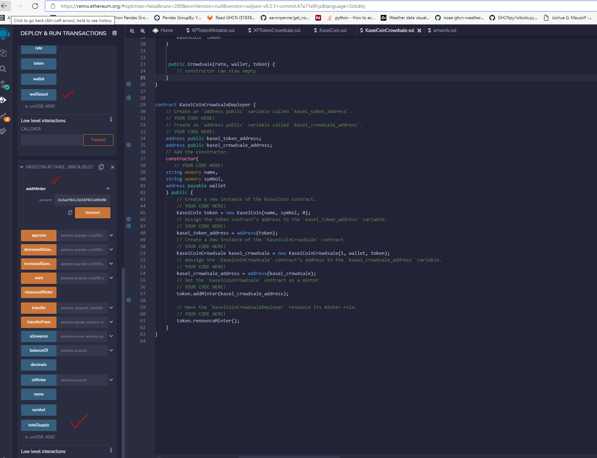

##                                                                                                               Kaise Coin - Currency beyond Stars

KaseiCoin will be a fungible token that’s ERC-20 compliant. We will use OpenZeppelin to launch a crowdsale that will allow people who are moving to Mars to convert their earthling money to KaseiCoin.

### **Technology used:**

- MetaMask 
- OpenZeppelin
- Solidity
- Remix
- Gnache

### **Evaluation Evidence:**

***Create and compile the KaseiCoin Token Contract:***

******

****Create and compile the KaseiCoin Crowdsale Contract:****

********

*****Create the KaseiCoin Deployer Contract:*****

********

*****Deploy the CrowdsaleSaleDeployer:*****

*****[DeployKaseiCrowdsaleDeployer](./Images/DeployKaseiCrowdsaleDeployer.mp4)*****
https://user-images.githubusercontent.com/49662110/165866979-55ca18b0-18bb-488b-af78-9f973e37c6ae.mp4

*****Link Addresses to Contracts :*****

*****[LinkAddresses](./Images/LinkAddresses.mp4)*****

https://user-images.githubusercontent.com/49662110/165867019-7758bd9f-54ec-48f5-adf8-884d01f0f9da.mp4

*Deploy Contracts Visuals:*

[DeployedContracts](./Images/DeployedContracts.mp4)

https://user-images.githubusercontent.com/49662110/165867026-db355859-77fa-4176-981b-3a5bb13060c0.mp4

### Usage

- *Test the functionality of the crowdsale by using test accounts to buy new tokens and then checking the balances of those accounts.*

[BuyTokens](./Images/BuyTokens.mp4)

https://user-images.githubusercontent.com/49662110/165867034-33def008-2c16-4177-91fd-c6b0aa3b98f5.mp4

- *Review the total supply of minted tokens and the amount of wei that the crowdsale contract has raised.*

**
